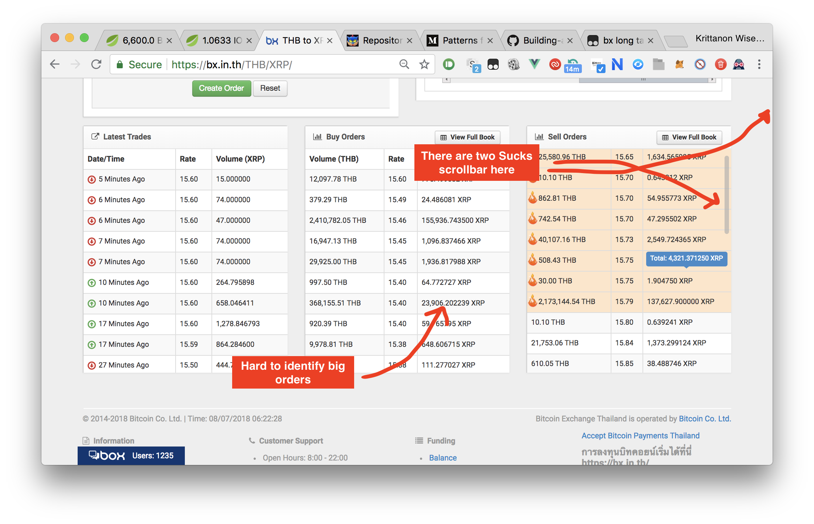
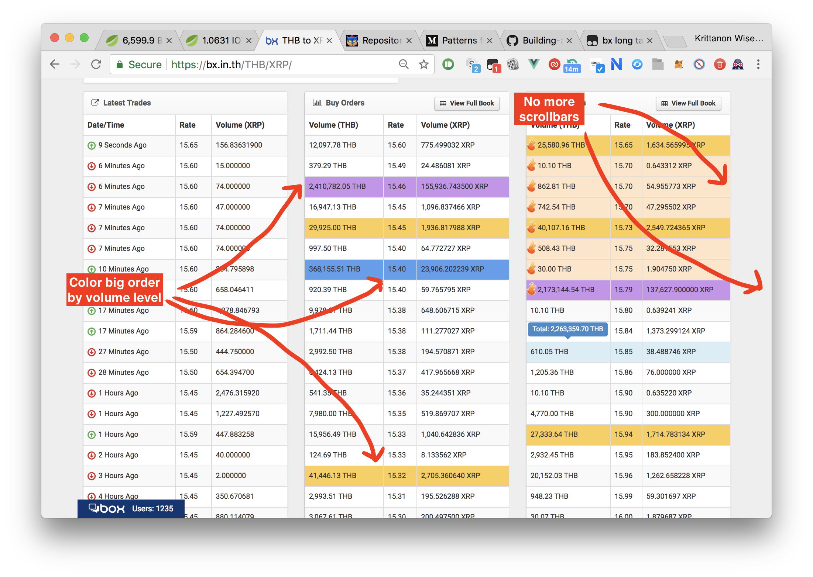

# bx.in.th-style
Tampermonkey script for edit bx.in.th (Bitcoin centralize exchange)

### How to use
1. install Tampermonkey (Chrome Extension)
2. copy text from script.js > go to Tampermonkey's dashboard > new script > paste > save
3. enable and run script... enjoy your life \0/

### Result
#### original style

 
#### new style

